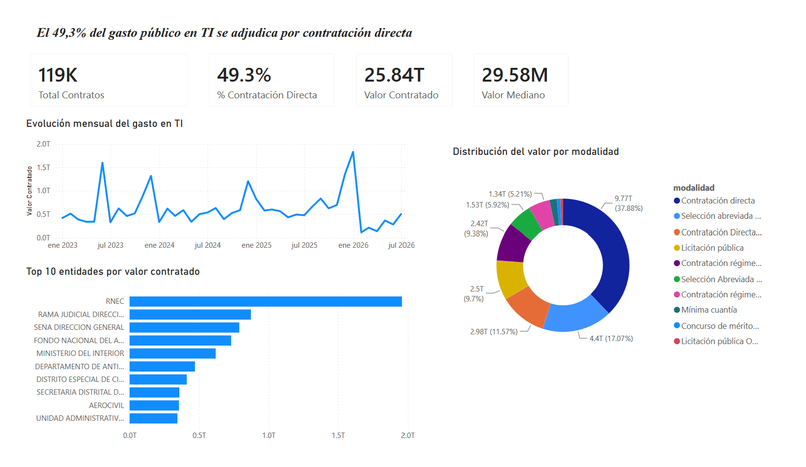

# Radiografía del gasto público en TI en Colombia

Análisis end-to-end de la contratación pública de tecnología en Colombia a partir
de datos abiertos oficiales: extracción vía API, limpieza reproducible en Python,
modelo dimensional y tablero en Power BI.

**Fuente:** [SECOP II – Contratos Electrónicos](https://www.datos.gov.co/Gastos-Gubernamentales/SECOP-II-Contratos-Electr-nicos/jbjy-vk9h),
Colombia Compra Eficiente · Portal Nacional de Datos Abiertos.



---

## El problema

El Estado colombiano publica cada contrato que firma, pero los datos crudos son
prácticamente inutilizables para responder preguntas de negocio: 85 columnas,
3,5 millones de registros, nombres de entidades y proveedores escritos de formas
distintas para el mismo actor, categorías sin diligenciar y valores en formatos
inconsistentes.

Este proyecto convierte ese ruido en respuestas concretas:

1. ¿Cuánto gasta el Estado en tecnología y cómo evoluciona en el tiempo?
2. ¿Qué entidades concentran ese gasto?
3. ¿Qué proveedores lo capturan y qué tan concentrado está el mercado?
4. ¿Qué proporción se adjudica sin competencia abierta?

La pregunta 4 es la más relevante: la contratación directa es legal y muchas veces
justificada, pero conocer su magnitud y dónde se concentra es información que los
datos crudos no entregan.

---

## Hallazgos

<!-- HALLAZGOS:INICIO -->

*Cifras generadas automáticamente por `src/generar_hallazgos.py` el 26/07/2026. Periodo analizado: 2023–2026. Todos los valores en pesos colombianos (COP).*

| Indicador | Valor |
|---|---|
| Contratos de TI analizados | 119,113 |
| Valor total contratado | $25.8 billones |
| Valor mediano por contrato | $29.6 millones |
| **Adjudicado por contratación directa** | **49.3%** |
| Entidades contratantes | 2,912 |
| Proveedores | 44,287 |
| Participación de los 10 mayores proveedores | 21.7% |
| Contratos respaldados por código UNSPSC oficial | 36.7% |

### 1. Casi la mitad del gasto en TI se adjudica sin competencia abierta

De los $25.8 billones de pesos contratados en tecnología, el **49.3%** se adjudicó por contratación directa. La cifra excluye deliberadamente la mínima cuantía, que por diseño aplica a compras pequeñas y no implica ausencia de competencia.

El resultado se sostiene al recortar el universo de distintas formas:

| Escenario | Contratos | Valor | % contratación directa |
|---|---:|---:|---:|
| Universo completo | 119,113 | $25.8 billones | 49.3% |
| Solo respaldados por código UNSPSC | 43,697 | $19.3 billones | 47.4% |
| Excluyendo valores atípicos | 118,694 | $25.8 billones | 49.3% |

La variación entre escenarios es de apenas 1.9%, así que el hallazgo no depende de cómo se delimite el universo.

### 2. El mercado está mucho menos concentrado de lo esperado

Participan **44,287 proveedores** distintos y los diez mayores captan apenas el **21.7%** del valor. Para un sector con altas barreras técnicas, es una dispersión notable: el gasto se reparte en miles de contratos pequeños en lugar de concentrarse en unos pocos grandes contratistas.

La mediana de $29.6 millones frente a un promedio de $217.0 millones confirma el patrón: unos pocos megacontratos elevan el promedio, pero el contrato típico es pequeño.

### 3. La concentración de la contratación directa varía mucho por entidad

| Entidad | Contratos | Valor |
|---|---:|---:|
| RNEC | 143 | $2.0 billones |
| RAMA JUDICIAL DIRECCION EJECUTIVA DE ADMINISTRACION JUDICIAL | 181 | $873.7 mil millones |
| SENA DIRECCION GENERAL | 70 | $790.1 mil millones |
| FONDO NACIONAL DEL AHORRO | 113 | $731.6 mil millones |
| MINISTERIO DEL INTERIOR | 300 | $620.2 mil millones |

El porcentaje de adjudicación directa no es uniforme entre entidades. Esa dispersión, más que el promedio nacional, es lo que señala dónde vale la pena mirar de cerca.

<!-- HALLAZGOS:FIN -->

---

## Arquitectura

```
API Socrata ──► extraer.py ──► data/raw/        CSV crudo, nunca se modifica
                                    │
                                    ▼
                          transformar.py ──► data/processed/   modelo estrella
                                    │
                    ┌───────────────┼───────────────┐
                    ▼               ▼               ▼
              explorar.py    generar_hallazgos.py   Power BI
              validación         README          dashboard.pbix
```

Cada script hace una sola cosa. Eso permitió ajustar el filtro de clasificación
tres veces sin volver a descargar 3,5 millones de registros: cada iteración costó
minutos en lugar de horas.

**Modelo dimensional** (esquema estrella, para que Power BI filtre rápido y las
medidas DAX no dependan de relaciones ambiguas):

```
              dim_fecha
                  │
dim_entidad ──► hechos_contratos ◄── dim_proveedor
```

| Tabla | Grano | Descripción |
|---|---|---|
| `hechos_contratos` | 1 fila = 1 contrato | Valor, fechas, modalidad, banderas de negocio |
| `dim_entidad` | 1 fila = 1 entidad | Nombre normalizado, NIT, departamento, orden, sector |
| `dim_proveedor` | 1 fila = 1 proveedor | Razón social normalizada, documento, si es pyme |
| `dim_fecha` | 1 fila = 1 día | Calendario continuo para inteligencia de tiempo |

---

## Decisiones de diseño

Las decisiones no obvias, que es donde está el criterio real del proyecto:

**El esquema se consulta sobre una muestra, no sobre una fila.** La API de Socrata
omite los campos vacíos en cada registro, así que una fila individual solo muestra
los campos que ella tiene poblados. Inspeccionando una sola fila, el esquema
reportó 81 columnas cuando el dataset tenía 85. Si a esa fila le hubiera faltado
`fecha_de_firma`, el filtro de fecha no se habría construido y se habría
descargado toda la historia del dataset sin ningún aviso. Se corrigió uniendo las
llaves de 200 filas.

**"TI" se define por código UNSPSC y por texto, con exclusiones.** El filtro
primario usa prefijos del clasificador oficial: el segmento `43` completo
(tecnologías de información y telecomunicaciones) y **solo la familia `8111`**
del segmento 81 (servicios informáticos).

Tomar el segmento 81 entero fue el primer intento y estuvo mal: ese segmento se
llama "servicios basados en ingeniería" e incluye ingeniería civil. Con él, el
universo daba $57,5 billones e incorporaba contratos como la construcción del
Aeropuerto del Café por $634 mil millones. Restringir a la familia 8111 y sumar
una lista de exclusiones (obra civil, convenios de "aunar esfuerzos", redes
sociales) dejó el universo en $25,8 billones.

**Cada contrato registra por qué vía entró.** El filtro por texto es más frágil
que el código oficial, porque depende de cómo redactó el objeto un funcionario.
En vez de escoger una sola vía, la columna `origen_clasificacion` guarda si el
respaldo fue el código UNSPSC o la coincidencia de texto. Eso permite recalcular
cualquier hallazgo con y sin los registros frágiles, en lugar de esconder el
supuesto detrás de un número único.

**El indicador reportado es más conservador que el disponible.** El pipeline marca
tres modalidades como de baja competencia, lo que arroja 66,2%. Pero la mínima
cuantía es un mecanismo legítimo para compras pequeñas y contarla exagera el
hallazgo. Se reporta únicamente la contratación directa: una cifra más baja y
defendible ante quien conozca contratación pública.

**Los atípicos se marcan, no se borran.** Un contrato de TI por 50.000 COP es casi
seguro un error de digitación, pero borrarlo silenciosamente distorsiona los
conteos. Se marca con `valor_atipico`, lo que deja la decisión visible y permite
medir su impacto.

**Los nombres se normalizan antes de agrupar.** "TECNOLOGÍA S.A.S.", "Tecnologia
SAS" y "TECNOLOGIA S A S" son el mismo proveedor. Sin normalizar tildes,
puntuación y sufijos societarios, cualquier ranking es falso. La normalización
también detecta textos de relleno: sin depurarlos, "VALOR PROVEEDOR" figuraba
entre los diez mayores contratistas del país con $454 mil millones.

**Las fechas invertidas anulan la duración, no la vuelven negativa.** Hay contratos
con fecha de fin anterior a la de inicio. Propagar un número negativo contamina
cualquier promedio; dejarlo nulo lo excluye correctamente del cálculo.

**El archivo se procesa por lotes.** 3,5 millones de filas por 85 columnas
consumen entre 8 y 12 GB en memoria. Se leen 250.000 filas a la vez, se conservan
solo los contratos de TI y se descarta el resto antes de acumular. Además se leen
20 columnas de 85. El resultado son 119.113 filas que caben sin problema.

**Las cifras del README se generan, no se escriben.** `generar_hallazgos.py`
calcula los números desde los datos y los inserta entre marcadores. Incluso los
titulares se derivan de las cifras, para que el texto no pueda contradecir a su
propia tabla cuando los datos cambien.

---

## Validación

El análisis se verifica de tres formas independientes.

**Pruebas automatizadas.** 35 pruebas que corren sin conexión, sobre un conjunto
sintético que reproduce los problemas reales del origen: duplicados, valores
nulos, fechas invertidas, nombres con y sin tilde, importes en formato colombiano
y anglosajón, y los falsos positivos detectados en producción.

```bash
python src/test_transformar.py
```

**Prueba de robustez.** El hallazgo principal se recalcula sobre universos
alternativos. Si la conclusión cambiara según cómo se recorte el universo, sería
frágil y habría que reportarla como rango. La variación observada aparece en la
tabla de escenarios de la sección de hallazgos, que se genera desde los datos:
este párrafo no repite la cifra a mano justamente para que no pueda quedar
desactualizado.

**Cruce entre herramientas.** El total calculado en Power BI coincide con el
calculado en Python por un camino completamente distinto. Esa coincidencia valida
las relaciones del modelo y los tipos de datos antes de construir encima.

---

## Cómo reproducirlo

Requisitos: Python 3.10+ y Power BI Desktop.

```bash
git clone https://github.com/Polvo07/secop-ti-analytics.git
cd secop-ti-analytics
pip install -r requirements.txt

# Opcional: token gratuito de Socrata para mejor límite de velocidad
# https://evergreen.data.socrata.com/signup
export SOCRATA_APP_TOKEN="tu_token"

python src/test_transformar.py        # verifica el entorno antes de descargar
python src/extraer.py --limite 5000   # prueba rápida
python src/extraer.py                 # descarga completa (~40 min)
python src/transformar.py             # genera el modelo en data/processed/
python src/explorar.py                # valida el universo y muestra hallazgos
python src/generar_hallazgos.py       # escribe las cifras en este README
```

Luego se abre `dashboard.pbix` y se actualizan las fuentes apuntando a
`data/processed/`.

**Sobre los datos versionados:** las dimensiones se incluyen en el repositorio
porque son pequeñas. La tabla de hechos pesa 53 MB y se omite; en su lugar se
versiona `data/muestra_hechos.csv`, una muestra aleatoria de 5.000 contratos con
semilla fija para que sea reproducible.

---

## Documentación

- **[`docs/como-funciona.md`](docs/como-funciona.md)** — explicación detallada de
  cada etapa, las decisiones tomadas y dónde se rompería el análisis
- **[`docs/medidas_dax.md`](docs/medidas_dax.md)** — medidas del tablero y
  estructura del modelo en Power BI
- **`docs/reporte_calidad.md`** — se genera en cada ejecución con cuántos
  registros se descartaron y por qué

---

## Limitaciones

- Los valores son **montos contratados, no ejecutados**. Un contrato firmado por
  $1.000 millones pudo pagarse parcialmente o no ejecutarse.
- El **último año está incompleto** y no es comparable con los anteriores.
- Solo el **36,7% de los contratos** tiene respaldo de código UNSPSC oficial; el
  resto entra por coincidencia de texto. Por eso el hallazgo principal se reporta
  también sobre el subconjunto respaldado por código.
- Un contrato de TI que ningún funcionario clasificó ni describió con los términos
  esperados queda fuera del universo, y no hay forma de detectarlo.

---

## Stack

Python (pandas, requests) · API Socrata / SoQL · Power BI · DAX · Git

---

## Autor

**Andrés Felipe Domínguez Pallares** — Estudiante de Ingeniería Multimedia,
Universidad Simón Bolívar.
[LinkedIn](https://www.linkedin.com/in/andres-dominguez-4877a51b8/) ·
[GitHub](https://github.com/Polvo07)
